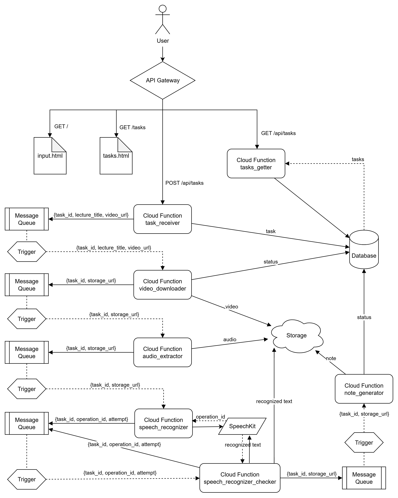

### Развертывание

#### Способ 1: Через файл конфигурации
Создайте файл `terraform.tfvars` в папке `terraform/`:
```hcl
YC_TOKEN  = ""
cloud_id  = ""
folder_id = ""
```

#### Способ 2: Через переменные окружения
```bash
export YC_TOKEN=""
export cloud_id=""
export folder_id=""
```

#### ffmpeg
ffmpeg уже предустановлен для Linux x64.

Если требуется другая ОС, то скачайте бинарник с https://github.com/eugeneware/ffmpeg-static/releases в папку functions/audio-extractor.
Пример:
```bash
cd functions/audio-extractor
wget 'https://github.com/eugeneware/ffmpeg-static/releases/download/b6.1.1/ffmpeg-linux-x64' -O ffmpeg
chmod +x ffmpeg
```

### Архитектура


### Использованные сервисы Yandex Cloud:
* Yandex API Gateway
* Yandex Object Storage
* Yandex Managed Service for YDB
* Yandex Message Queue
* Yandex Cloud Functions
* Yandex Identity and Access Management
* Yandex Resource Manager
* Yandex SpeechKit
* Yandex GPT API
